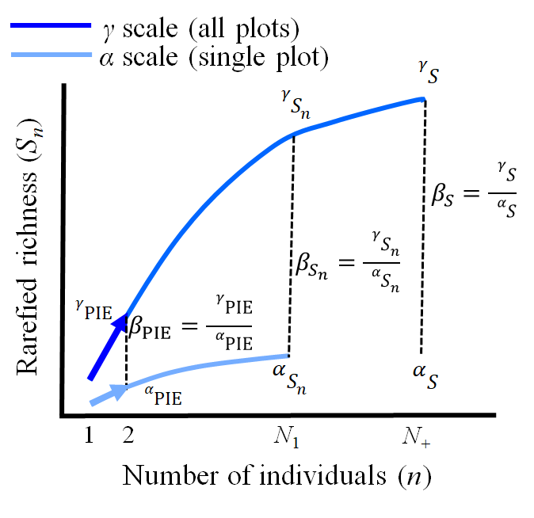

```{r setup, include=FALSE}
knitr::opts_chunk$set(echo = TRUE)
```

This tutorial introduces key concepts in biodiversity science using R. After a brief introduction to R,
we'll use fundamental concepts of biodiversity to reinforce and practice key skills common to most data science projects.
These skills include manipulating, visualising, and modelling data. 

## R

R is an interactive environment for data science. It is not the only programming language (see e.g., Julia, Python, Stan) used for data science. 
All these languages have their strengths and weaknesses, and some might be more suited to specific (and specialised) tasks. 
For example, [Stan](https://mc-stan.org/) is a probabilistic programming language specifically designed for statistical modelling. 

R is a great place to start developing skills required to do data science. 
It provides a relatively complete environment where many (all?) important aspects of manipulating, visualising and modelling data can be implemented.

Some useful sources to get started and contining to develop your data science skills:
  - [Cookbook for R](http://www.cookbook-r.com/)
  - [R for Data Science](https://r4ds.had.co.nz/index.html). This text also has many pointers to other useful resources. Hadley Wickham has become a very influential R developer, 
  and the package `ggplot2` in particular, has become a integral part of the visualisation toolbox for many people who use R.

### A quick start to programming with R

Programming underpins all data science. It is the tool that allows you to do the other key tasks of manipulating, visualising and modelling data. 
Practice writing code that is easy to read and understand. It'll help you, and help others to help you when you get stuck. 

Some key considerations include:

- comment your code. Even seemingly trivial statements of what a particular chunk of code is meant to do can help you in the future. And clear, concise
comments will also allow you to be a more effective collaborator in projects that involve team work.

- use meaningful (and as concise as possible) variable names. 

- use spaces between operators.


Some basics: 

R as calculator:
```{r}
5 + 4
2^3
(1 + 2 + 3)/6
# a calculator with many inbuilt functions!
sin(pi / 2)
```

New objects can be created with `<-`. 

This is commonly adopted style convention in R. `=` also works just fine. 
```{r}
x <- 1:10 # note the spaces surrounding '<-', this makes code easier to read. The keyboard shortcut (Alt + -) in Rstudio inserts these spaces by default. 
x
```

Here we've assigned a vector of integers counting from one to ten to the object named x.

R has many built-in functions. 

They have the structure:
function_name(arg1 = value1, arg2 = value2, ...).

Help files can be found for all functions using ?function_name

```{r}
?seq
x1 <- seq(from = 1, to = 10, by = 1)
```

You can use R to do logical tests. 
```{r}
x <- 1:10
x1 <- seq(from = 1, to = 10, by = 1)
x==x1 # compares each element of the two vectors
length(x) > length(x1) # is the length of x greater than x1?
length(x) >= length(x1) # is the length of x greater than or equal to x1?
?'==' # see other relational operators
```
### Scripts
You'll typically want to write your code in scripts. These can be relatively self-contained units of work, though 
for some tasks that you find yourself doing frequently, you might write your own function and save it to call whenever
you need to do some repetitive task. 

Scripts typically load the packages required at the top, and then proceed to accomplish some particular task. 
Write comments that describe each step. You'll thank yourself later.

```{r}
# a (redundant) function to add two variables together
my_sum_function <- function(var1, var2){
  var1 + var2
}

my_sum_function(1, 1)
sum(c(1,1))==my_sum_function(1, 1)
```

### Packages
An R *package* is a collection of functions, data and documentation that expands the functionality of base R. The free and open-source
nature of the [R project](https://www.r-project.org/) means that there is an enormous number of packages. The most reputable 
place to find packages is on the Comprehensive R Archive Network (CRAN). Packages available on the CRAN have gone through a form of peer review, 
meaning that they have been evaluated and passed some tests. However, some creators of useful packages now commonly use Github to distribute their
work. With the huge number of available packages, there is an element of 'buyer-beware' regarding the use of any package. Judging which packages are most
reliable comes with experience and use, though as a 'rule of thumb', it is best to get packages from
CRAN where possible. However, for many packages under active development (where cutting edge tools might be more readily available), 
gettting packages from repositories such as Github might provide you with the tools you want for a particular task. 

Let's get a package of packages from CRAN. The [Tidyverse](https://www.tidyverse.org/) is a collection of packages for data science,
and we'll use tools from some of its component packages for data manipulation and visualisation. Installing the whole suite is simply a 
convenient short cut.
```{r, eval = FALSE}
install.packages('Tidyverse')
```

We'll also use a couple of packages developed by Jon's group. `mobsim` is a package that was developed to simulate and sample biodiversity data.
`mobr` provides many useful functions for calculating and comparing biodiversity metrics across discrete and continous covariates and scales.

```{r, eval = FALSE}
# get mobsim from CRAN
install.packages('mobsim')
# you may get a warning/error depending on your version of R. If so, try getting it from Github
install.packages('remotes')
remotes::install_github("MoBiodiv/mobsim", build_vignettes = TRUE)
# and let's get the development version of mobr from Github
remotes::install_github('mobiodiv/mobr', ref='dev')

```

To make the functions, data and documentation from a package available to you, you need to load the package.
```{r, fig.width=9}
library(mobsim)
library(mobr)
library(tidyverse)

set.seed(666)

# simulate two communities: Both communities will have the same total number of species,
# and the same total number of individuals. 
# However, individuals of each species will be distributed randomly in space for one community, 
# the other has individuals of each species aggregated or clumped in space.
comm_rand <- sim_poisson_community(s_pool = 30, n_sim = 500)
comm_agg <- sim_thomas_community(s_pool = 30, n_sim = 500, sigma = 0.05, mother_points = 1)

# visualise the communities
par(mfrow = c(1,2)) # set up the graphic device to have one row, two columns
plot(comm_rand)
plot(comm_agg)
```

## Biodiversity
Biodiversity is a catch-all term applied generally to describe biological diversity. Biodiversity can 
refer to genes, species or ecosystems, as well as other types of interesting diversity (e.g., traits) as well. For simplicity
(and because it is the level I work at and am most familiar with), I'm going to refer to species diversity as biodiversity. 
But the fundamental concepts covered -- multidimensionality and scale-dependence -- apply for all aspects of biodiversity.

Biodiversity is multidimensional and scale-dependent. Multidimensionality arises because biodiversity is the combination 
of the total number of individuals, and the relative abundance and total number of species
in an area. Biodiversity is scale-dependent because the number of species increases non-linearly with 
increasing sample effort (i.e., the number of individuals counted or samples collected) and 
spatial scale (i.e., the area over which samples are collected). Combined, multidimensionality and 
scale-dependence makes quantifying biodiveristy and its change hard. But embracing this complexity can 
lead to greater insights (Chase et al. 2018, McGill 2011a).

Embracing multidimensionality and scale-dependence requires analyses of multiple metrics across multiple
scales (Chase et al. 2018, McGlinn et al. 2019). Metrics that capture the key components of abundance, evenness 
and richness (McGill 2011b) are a good starting point. And scale-dependence can be examined either discretely 
or continuously, the key being that the changing components of biodiversity are examined at more than one scale. 

We'll use the `mobsim` and `mobr` packages to simulate, sample, and quantify  changes in biodiversity at three discrete spatial scales. 
Ecologists often use alpha-, gamma- and beta-diversity to refer to these three scales, which we define as:

- Alpha ($\alpha$) diversity refers to diversity at the scale of individual samples, e.g., a quadrat or transect.
$\alpha$-diversity is often referred to as local diversity, and quantifies the average (and variation) 
in diversity at small spatial scales (e.g., at multiple sites).
- Gamma ($\gamma$) diversity refers to diversity at the scale of all the individual samples combined, i.e., all
quadrats or transects combined. $\gamma$-diveristy is often referred to as regional diversity, and here it 
quantifies the total diversity of a collection of samples (often from multiple sites).
```{r}
samp_rand <- sample_quadrats(comm = comm_rand, n_quadrats = 4, quadrat_area = 0.05, 
                             plot = TRUE, method = 'random', avoid_overlap = TRUE)
```

- Beta ($\beta$) diversity scales between alpha- and gamma-diversity, and is calculated as the ratio of gamma over alpha,
i.e., $\beta = \gamma/\overline{\alpha}$. $\beta$-diversity quantifies spatial (i.e., site-to-site) variation in community 
composition. 

Across these three spatial scales, we use metrics derived from the Individual-Based Rarefaction (IBR) curve to 
quantify the multidimensional nature of biodiversity change (Chase et al. 2018, McGlinn et al. 2019).

The metrics we have selected are:

- $N$ - Number of individuals*
- $S$ - Observed species richness
- $S_n$ - Rarefied species richness (Hurlbert 1971)
- $PIE$ - Probability of Interspecific Encounter (Hurlbert 1971)
- $S_{PIE}$ - Effective number of species transformation of the PIE (Jost 2007)

We compute metrics at multiple scales: the scale of samples ($\alpha$-scale), the scale all samples combined
($\gamma$-scale) and $\beta$-scale, as seen on the individual rarefaction curves in the figure below: 

<center>{ width=50%}</center>

There is a lot going on in this figure! Let's look at each scale in turn for the two communities we created earlier.

We've already collected some samples from the community where individuals were distributed randomly in space. 
We need to do the same for the other community where individuals of the same species are aggregated (or clumped)
together spatially.

```{r}
samp_agg <- sample_quadrats(comm = comm_agg, n_quadrats = 4, quadrat_area = 0.05, 
                             plot = TRUE, method = 'random', avoid_overlap = TRUE)
```

### Individual-based rarefaction 
Individual-Based Rarefaction (IBR; Hurlbert 1971, Gotelli & Cowell 2002) and the associated rarefaction curve provide 
a simple, coherent and comprehensive framework to visualise the multicomponent nature of biodiversity. The curves show
how the expected number of species increases with increasing numbers of individuals.

Let's draw rarefaction curves for our samples at the alpha- and gamma-scales.

First, we need to know the 'structure' of our data. There are two data structures for species diversity data 
that are frequently encountered in ecology: **wide** and **long**.

**Wide** data has a column for each variable. In biodiversity data, site by species matrices document species incidences 
(i.e., the presence or absence of each species) or abundances (e.g., counts of individuals, biomass or percent cover) 
at multiple sites. Rows typically represent sites, and each column documents a species (however this is sometimes reversed!). 
Incidence data uses a zero (0) to represent species absences, and a one (1) for species presences in each cell of the matrix. 
Other data types have numeric values, e.g., integers for counts of individuals. 

```{r}
# check structure of the samples 
str(samp_rand)

```

We see that it is a list, with two elements. Lists are a very flexible data structure, which can accomodate different data types (e.g., numeric, strings, factors), in different elements.
The first element, spec_dat, is 'wide' data, with each row recording one of our samples (called sites), each column a different species, and each element containing the abundance
of a species at a site. 

```{r}
rand_wide <- samp_rand$spec_dat
agg_wide <- samp_agg$spec_dat
# note that different functions in different packages might require the species in rows, and sites in columns
t(rand_wide) # t() transpose columns and rows
# calculate rarefaction curves for each site (in both communities)
rand1_rare <- rare_curve(rand_wide[1,])
rand2_rare <- rare_curve(rand_wide[2,])
rand3_rare <- rare_curve(rand_wide[3,])
rand4_rare <- rare_curve(rand_wide[4,])
agg1_rare <- rare_curve(agg_wide[1,])
agg2_rare <- rare_curve(agg_wide[2,])
agg3_rare <- rare_curve(agg_wide[3,])
agg4_rare <- rare_curve(agg_wide[4,])
```
We can add these curves one at a time to a plot using functions in base R.
But with a little bit more data wrangling (manipulation), we can make use of the power of ggplot2.
ggplot2 requires long data.

**Long** data has one row per observation or measurement. 

To make use of ggplot, we'll create a long dataframe with all our local or alpha-scale samples from the two communities.
```{r}
alpha_rarefaction <- tibble(spatial_pattern = c(rep('random', times = sum(length(rand1_rare),
                                                                    length(rand2_rare),
                                                                    length(rand3_rare),
                                                                    length(rand4_rare))),
                                          rep('aggregated', times = sum(length(agg1_rare),
                                                                    length(agg2_rare),
                                                                    length(agg3_rare),
                                                                    length(agg4_rare)))),
                      site = c(rep('site1', times = length(rand1_rare)),
                               rep('site2', times = length(rand2_rare)),
                               rep('site3', times = length(rand3_rare)),
                               rep('site4', times = length(rand4_rare)),
                               rep('site1', times = length(agg1_rare)),
                               rep('site2', times = length(agg2_rare)),
                               rep('site3', times = length(agg3_rare)),
                               rep('site4', times = length(agg4_rare))),
                      N = c(1:length(rand1_rare), 1:length(rand2_rare), 1:length(rand3_rare), 1:length(rand4_rare),
                            1:length(agg1_rare), 1:length(agg2_rare), 1:length(agg3_rare), 1:length(agg4_rare)),
                      S_n = c(rand1_rare, rand2_rare, rand3_rare, rand4_rare,
                              agg1_rare, agg2_rare, agg3_rare, agg4_rare))

alpha_rarefaction
```

See how each row is a unique observation. That is the defining characteristic of **long** data. 

Now we can use ggplot2 to visualise the alpha-scale rarefaction curves.
```{r}
ggplot() +
  geom_line(data = alpha_rarefaction,
            aes(x = N, y = S_n, colour = site, linetype = spatial_pattern)) +
  labs(x = 'Number of individuals',
       y = 'Expected number of species')
```

We can 'read' a lot of information of these rarefaction curves with a bit of practice. The end points of the curves
show us how many individuals and and how species were sampled at each site. The curvature or shape of the IBR curve tells us something
about the relative abundance of species. In particular, the Probability of Interspecific Encounter (PIE) is equal to the slope 
at the base of the IBR (Olszewski 2004), and is a metric of evenness that is relatively insensitive to sample effort;
more even communities have a higher PIE.

Note that for inferences we prefer the numbers equivalent or effective number transformation of the PIE, which we label $S_{PIE}$. 
$S_{PIE}$ is equal to the inverse of Simpsons concentration (Jost 2006), and diversity of order q = 2 (Jost 2007):
$D = (\sum_{i=1}^{S} p_{i}^{q})^{1/(1-q)} = \frac{1}{\sum_{i=1}^{S} p_{i}^{2}}$, where $S$ is the number 
of species and $p_i$ is the proportion of the assemblage represented by species *i*. 
As a consequence, changes in $S_{PIE}$ are most strongly influenced by the number of abundant or common species in assemblages.

Let's do the same for the gamma-scale. Recall, we are going to combine all our sites together and call that the gamma-scale
```{r}
# combine all sites 
rand_wide_gamma <- colSums(rand_wide)
agg_wide_gamma <- colSums(agg_wide)

rand_gamma_rare <- rare_curve(rand_wide_gamma)
agg_gamma_rare <- rare_curve(agg_wide_gamma)

gamma_rarefaction <- tibble(spatial_pattern = c(rep('random', times = length(rand_gamma_rare)),
                                                rep('aggregated', times = length(agg_gamma_rare))),
                            N = c(1:length(rand_gamma_rare),
                                  1:length(agg_gamma_rare)),
                            S_n = c(rand_gamma_rare,
                                    agg_gamma_rare))

ggplot() +
  geom_line(data = gamma_rarefaction,
            aes(x = N, y = S_n, linetype = spatial_pattern)) +
  labs(x = 'Number of individuals',
       y = 'Expected number of species')

```

Beta-diversity is the scale 'in between' the alpha- and gamma-scales. Most commonly, it is calculated as the 
ratio of gamma / alpha, i.e., $\beta = \gamma/\overline{\alpha}$. Instead of visualising beta-diversity with a 
curve, let's do some calculations at the other two scales and use them to calculate beta-diversity for our two
communities.

Before doing the calculations, recall that our samples are currently in a wide format. Being able to switch between
wide and long formats is an important skill to learn. We've already seen that to use ggplot2 we need long data. Similarly,
depending on the particular package and function being used, the same data might need to be either might be more easily used
in one or the other format.

Here we'll use pivot_longer from the `tidyr` package to go from wide to long. We'll also introduce some other useful
programming tools from the Tidyverse.

```{r}
# first add a column for the site names
rand_wide <- as_tibble(rand_wide, rownames = 'site')
agg_wide <- as_tibble(agg_wide, rownames = 'site')
# check the first and last 'species' columns
colnames(rand_wide)
colnames(agg_wide)

rand_long <- tidyr::pivot_longer(data = rand_wide, 
                                 # these are the columns we want to make longer
                                 cols = species1:species9, 
                                 # name of the new column
                                 names_to = 'species',
                                 # name of the column where the values will be stored
                                 values_to = 'n')

agg_long <- tidyr::pivot_longer(data = agg_wide, 
                                # these are the columns we want to make longer
                                 cols = species1:species9, 
                                 # name of the new column
                                 names_to = 'species',
                                 # name of the column where the values will be stored
                                 values_to = 'n')

# now, combine them and calculate our metrics of choice
alpha_metrics <- bind_rows(rand_long %>% 
                             mutate(spatial_pattern = 'random'),
                           agg_long %>% 
                             mutate(spatial_pattern = 'aggregated')) %>% 
  group_by(spatial_pattern, site) %>% 
  summarise(S = calc_div(n, index = 'S'),
            N = calc_div(n, index = 'N'),
            S_PIE = calc_div(n, index = 'S_PIE', replace = TRUE)) %>% 
  ungroup()

# The other useful metric S_n, expected richness for n individuals needs a target n.
# Find the minimum N across all sites and use that:
minN = min(alpha_metrics$N)

Sn <- bind_rows(rand_long %>% 
                             mutate(spatial_pattern = 'random'),
                           agg_long %>% 
                             mutate(spatial_pattern = 'aggregated')) %>% 
  group_by(spatial_pattern, site) %>% 
  summarise(Sn = calc_div(n, index = 'S_n', effort = minN)) %>% 
  ungroup()

# get Sn into the alpha_metrics dataframe using a join
alpha_metrics <- left_join(alpha_metrics, 
                           Sn)

# create a four panel figure with our alpha-scale metrics
alphaN <- ggplot() +
  geom_boxplot(data = alpha_metrics,
               aes(x = spatial_pattern, y = N)) +
  labs(x = 'Spatial distribution of individuals',
       y = 'Total number of individuals')

alphaS <- ggplot() +
  geom_boxplot(data = alpha_metrics,
               aes(x = spatial_pattern, y = S)) +
  labs(x = 'Spatial distribution of individuals',
       y = 'Species richness')

alphaSn <- ggplot() +
  geom_boxplot(data = alpha_metrics,
               aes(x = spatial_pattern, y = Sn)) +
  labs(x = 'Spatial distribution of individuals',
       y = 'Rarefied richness')

alphaS_PIE <- ggplot() +
  geom_boxplot(data = alpha_metrics,
               aes(x = spatial_pattern, y = S_PIE)) +
  labs(x = 'Spatial distribution of individuals',
       y = 'Evenness')

cowplot::plot_grid(alphaN, alphaS,
                   alphaSn, alphaS_PIE)


```

And now the calculations for the gamma-scale.
```{r}
# need gamma-scale data (all sites combined)
rand_gamma_long <- tibble(species = colnames(rand_wide[,-1]),
                                             n = colSums(rand_wide[,-1])) %>% 
  mutate(spatial_pattern = 'random')

agg_gamma_long <- tibble(species = colnames(agg_wide[,-1]),
                                             n = colSums(agg_wide[,-1])) %>% 
  mutate(spatial_pattern = 'aggregated')
                                
gamma_metrics <- bind_rows(rand_gamma_long,
                           agg_gamma_long) %>% 
  group_by(spatial_pattern) %>% 
  summarise(S = calc_div(n, index = 'S'),
            N = calc_div(n, index = 'N'),
            S_PIE = calc_div(n, index = 'S_PIE', replace = TRUE)) %>% 
  ungroup()

# calculate beta-diversity

```


# References
Chase, J.M., McGill, B.J., McGlinn, D.J., May, F., Blowes, S.A., Xiao, X., Knight, T.M., Purschke, O., Gotelli, N.J., 2018. Embracing scale‐dependence to achieve a deeper understanding of biodiversity and its change across communities. Ecol Lett 21, 1737–1751.

Hurlbert, S.H., 1971. The nonconcept of species diversity: a critique and alternative parameters. Ecology 52, 577–586.

Jost, L., 2006. Entropy and diversity. Oikos 113, 363–375.

McGill, B.J., 2011a. Linking biodiversity patterns by autocorrelated random sampling. Am J Bot 98, 481–502.

McGill, B.J., 2011b. Species abundance distributions, in: Biological Diversity: Frontiers In Measurement & Assessment (Eds Magurran, A. & McGill, B.). Oxford University Press, pp. 105–122.

McGlinn, D.J., Xiao, X., May, F., Gotelli, N.J., Engel, T., Blowes, S.A., Knight, T.M., Purschke, O., Chase, J.M., McGill, B.J., 2019. Measurement of Biodiversity (MoB): A method to separate the scale‐dependent effects of species abundance distribution, density, and aggregation on diversity change. Methods in Ecology and Evolution 10, 258–269.

Olszewski, T.D., 2004. A unified mathematical framework for the measurement of richness and evenness within and among multiple communities. Oikos 104, 377–387.
